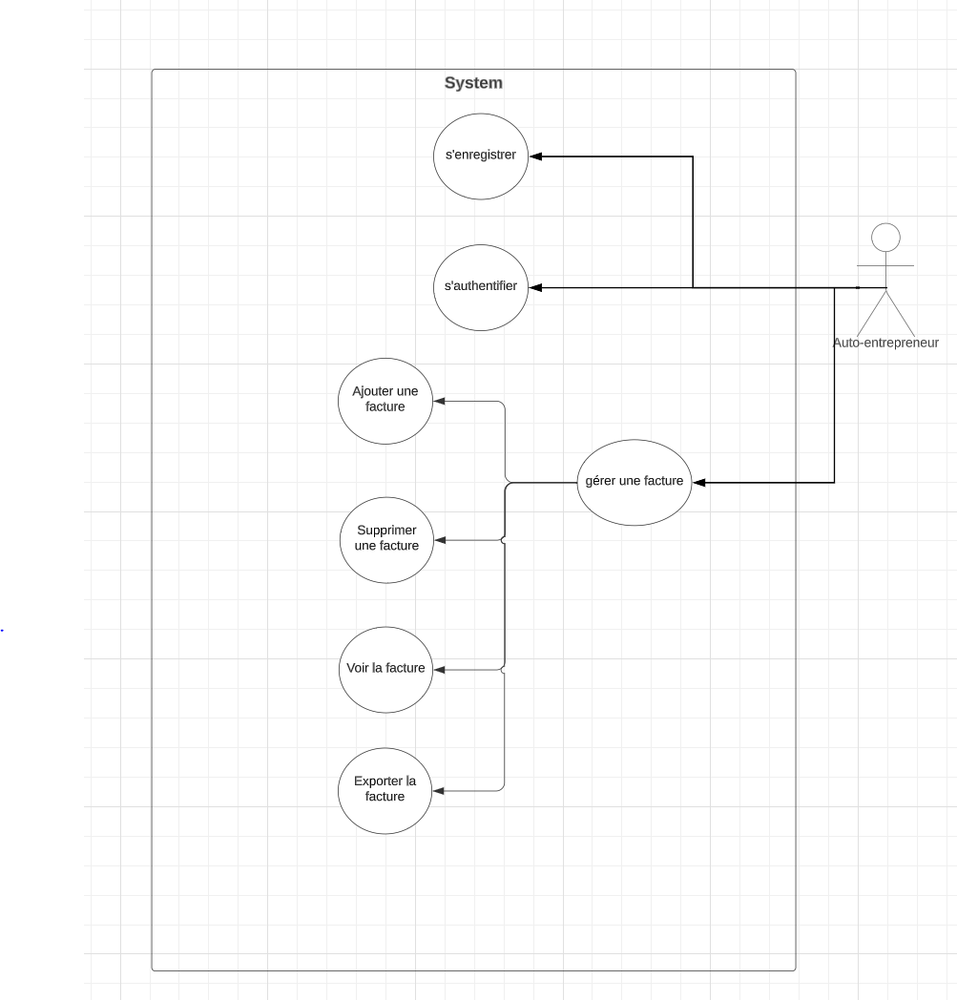
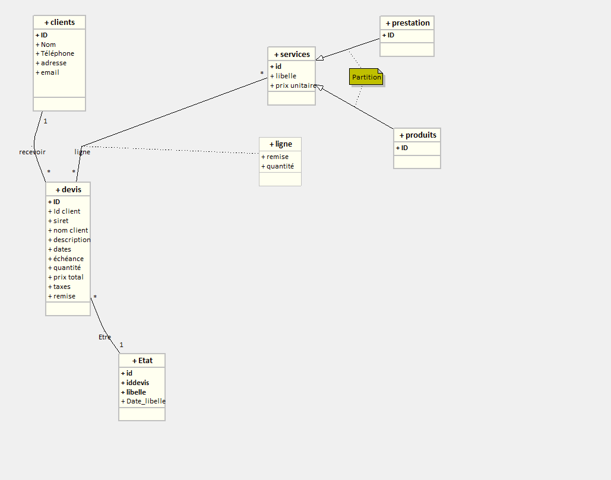
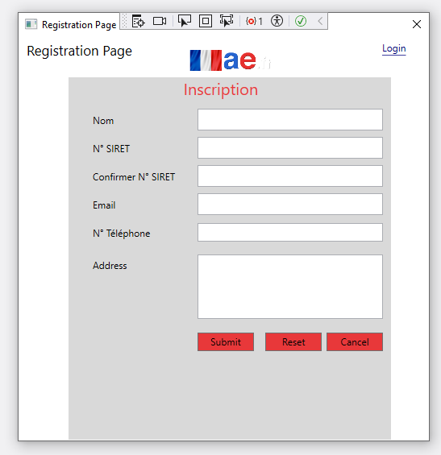
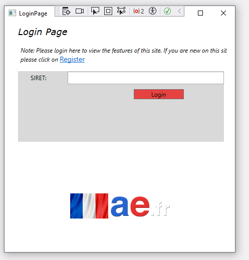
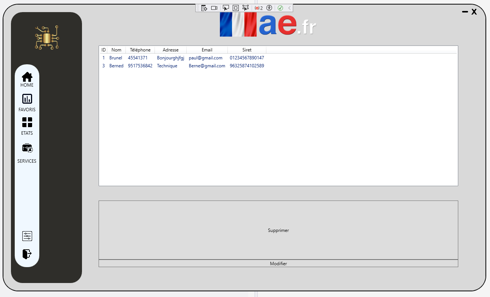
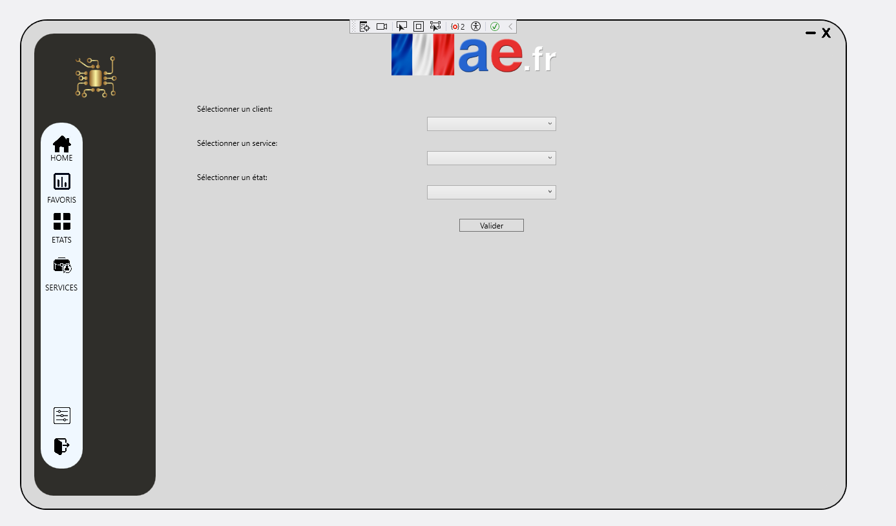

---
runme:
  id: 01HVP37SM7XM6GXA9KN8HKE25B
  version: v3
---

# Autofact-V6

# Pré-requis

Avant de commencer, assurez-vous d'avoir les éléments suivants installés sur votre système :

# Installation

# Use case

# UML

# Paul

Register page

Login page

Modifier page

Devis

